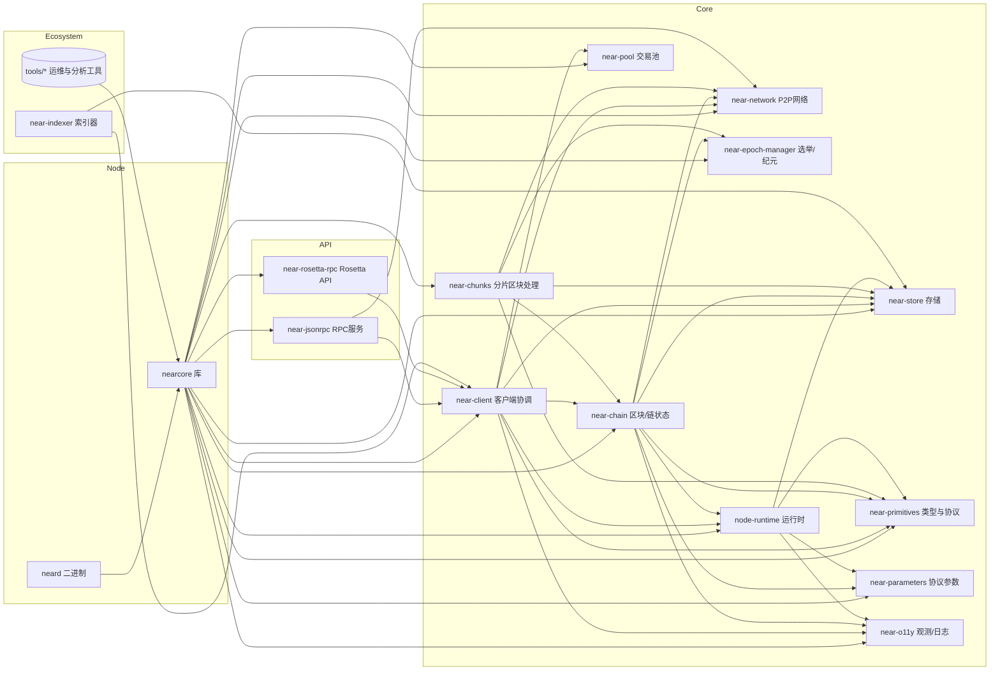

# NEARCore 架构设计总览

本文档梳理 nearcore 项目的代码结构、模块职责、依赖关系与数据流。内容基于工作区内 Cargo 配置和核心源码文件，帮助读者快速理解整体架构并定位关键实现。

## 项目分层与核心组件
- `neard`：节点二进制入口，负责 CLI、配置读取、特性开关与服务启动。
- `nearcore`：节点组装库，集成链、网络、运行时、RPC 等组件，统一生命周期管理。
- Core 层：`near-client`、`near-chain`、`near-chunks`、`near-epoch-manager`、`near-pool`、`node-runtime`、`near-store`、`near-primitives`、`near-parameters`、`near-network`、`near-o11y`。
- API 层：`near-jsonrpc`、`near-rosetta-rpc` 对外提供 HTTP/RPC 能力。
- 工具/生态：`near-indexer` 及 `tools/*` 运维与分析工具。

## 模块依赖关系图
下图是工作区内核心模块的依赖关系（Mermaid）。完整源文件位于 `docs/project-structure/diagrams/nearcore-deps.mmd`。

## 模块输入/输出接口概览
- `near-network`
  - 输入：来自 `near-client` 的网络请求、路由指令；来自 `near-jsonrpc` 的调试查询。
  - 输出：区块/分片数据、交易传播、peer 状态（供 client/JSON-RPC 使用）。
  - 关键类：`PeerManagerActor`、`PeerManagerAdapter`（在 `chain/network/src`）。
- `near-client`
  - 输入：网络消息、配置与协议参数；RPC 指令（如查询、交易提交）。
  - 输出：区块生产/验证流程驱动、状态查询结果、节点状态信息。
  - 关键类：`ClientActorInner`（`chain/client/src/client_actor.rs`），对接链、网络、存储与运行时。
- `near-chain`
  - 输入：交易与分片数据（来自网络/池）；运行时执行结果；协议参数与纪元信息。
  - 输出：区块/状态更新、校验结果、回滚/重组逻辑。
  - 关键类：`Chain`（`chain/chain/src/chain.rs`）。
- `near-chunks`
  - 输入：分片块与校验数据；纪元信息；网络层数据。
  - 输出：分片处理结果、与 `near-chain` 的交互事件。
- `near-epoch-manager`
  - 输入：链状态、验证者信息与历史；协议参数。
  - 输出：纪元切换、席位分配与选举结果。
  - 关键类：`EpochManager`（`chain/epoch-manager/src/lib.rs`）。
- `node-runtime`
  - 输入：合约代码、交易与状态（来自 `near-store`）；协议参数与 gas 规则。
  - 输出：执行结果与状态变更。
  - 关键类：`Runtime`（`runtime/runtime/src/lib.rs`）。
- `near-store`
  - 输入：链/运行时的状态读写、索引需求。
  - 输出：持久化数据访问；快照与校验机制。
  - 关键类：`Store`（`core/store/src/store.rs`）。
- `near-primitives` / `near-parameters`
  - 输入/输出：统一的协议类型（交易、块、视图）与参数（限额、费用、特性开关）。
- `near-jsonrpc`
  - 输入：HTTP 请求（Axum 路由）；调用 `near-client`/`near-network` 获取数据。
  - 输出：标准化的 JSON-RPC 响应与 OpenAPI 描述；状态、查询、交易处理接口。
  - 关键点：`start_http`（`chain/jsonrpc/src/lib.rs`）启动 HTTP 服务；`JsonRpcHandler` 实现方法路由。
- `near-rosetta-rpc`
  - 输入：来自 Rosetta 规范的请求；依赖 `nearcore`/`near-client`。
  - 输出：符合 Rosetta 的链数据与账户操作接口。
- `near-pool`
  - 输入：外部提交与网络传播的交易。
  - 输出：供链与客户端消费的待处理交易集合、筛选与优先级策略。
- `near-o11y`
  - 输入：各模块的日志、指标事件。
  - 输出：标准化日志、Tracing、Prometheus 指标暴露。

## 数据流与调用关系
- 入站数据：`near-network` 接收块/交易/分片消息 → 交由 `near-client` 协调处理。
- 执行路径：`near-client` 触发 `near-chain` 验证与状态更新 → `node-runtime` 执行合约 → 状态写入 `near-store`。
- 出站接口：`near-jsonrpc` 通过 `JsonRpcHandler` 调用 `near-client` 的 view/process 通道，返回查询与交易处理结果；`near-rosetta-rpc` 将标准化数据对外暴露。
- 纪元与参数：`near-epoch-manager` 基于链状态与 `near-parameters` 决定席位与特性；各模块在 `near-o11y` 中记录指标。

## 运行与入口
- 入口：`neard/src/main.rs` 与 `neard/src/cli.rs`，解析命令行与配置，启动 nearcore 组装的服务。
- 特性：`Cargo.toml` 中的 features（如 `json_rpc`、`rosetta_rpc`、`sandbox`、`nightly`）控制编译与运行能力。

## 参考
- Workspace 成员列表：`Cargo.toml [workspace] members`
- 关键依赖清单：`nearcore/Cargo.toml`、`neard/Cargo.toml`
- JSON-RPC 设计：`chain/jsonrpc/README.md`、`chain/jsonrpc/openapi`